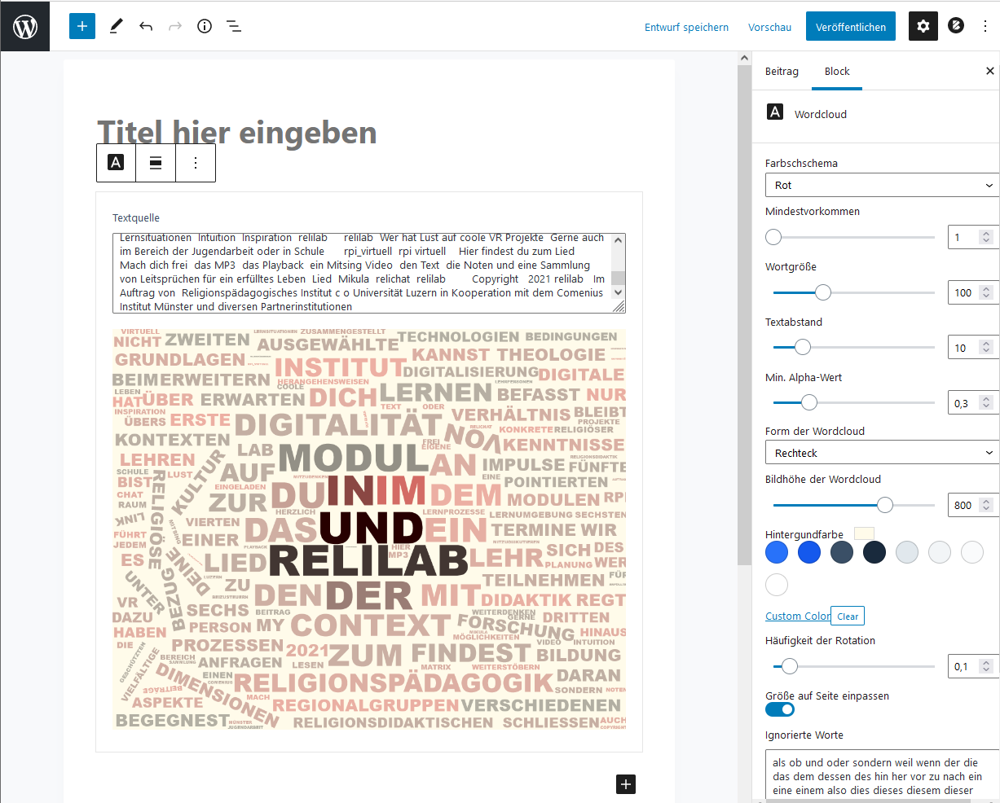
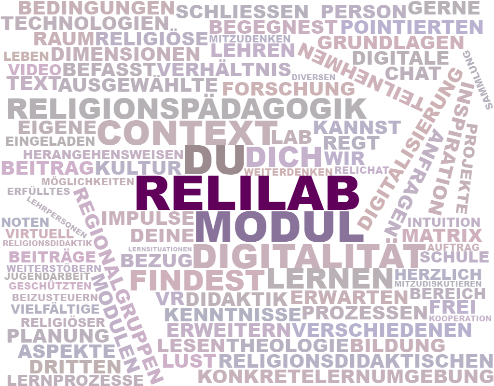
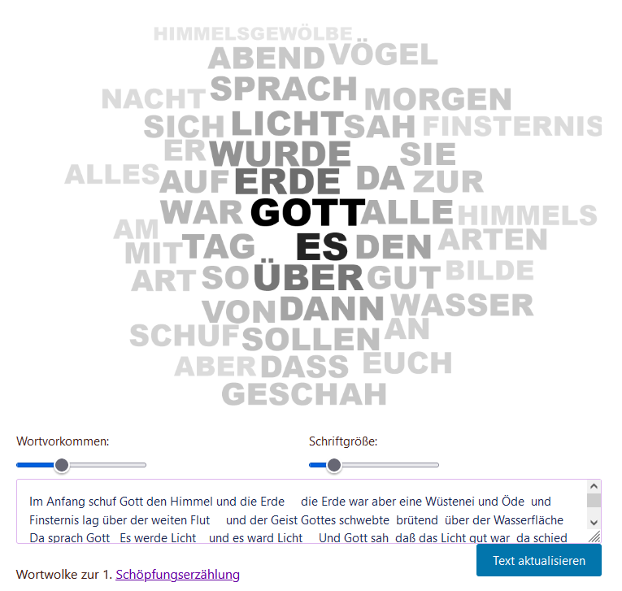

# rpi WordCloud
A Gutenberg Editor Block for WordPress to display cloud words from any text. Based on the WP Word Cloud Plugin from nickyreinert.
Developed for the relilab's OER Maker Space (my.relilab.org)

Stellt einen Gutenberg-Block zum Generieren von grafischen Wortwolken auf der Grundlage eines  beliebigen Textes zur Verfügung. 
Erlaubt Seitenbesuchern, die Darstellung und Fokussierung der Wortwolke temporär zu manipulieren. 
Das Plugin wurde auf der Codebasis des WP Word Cloud Plugins von Niki Reinert weiterentwickelt, welches ursprünglich nur über shortcodes zu konfigurieren war.
Die Konfiguration geschieht nun auschließlich über einen wysiwyg Block. Dieses Plugin wurde für den OER Maker Space des relilab (my.relilab.org) entwirckelt.

## What is eine WordCloud?
Eine Wortwolke visualisiert das Vorkommen von Wörtern in einem Text. Sie zählt die Wörter und platziert sie auf einer Leinwand. Anhand des Vorkommens jedes Wortes wird die Größe des Wortes berechnet. 

## Installation
Öffne das Dashboard → Menü → Plugins → Plugin hochladen.
Klicke auf Datei auswählen, um den Speicherort des heruntergeladenen ZIP-Archivs auf dem Computer zu finden. Wähle dann: Jetzt installieren.
Wähle danch "Plugin aktivieren"

**Wichtig**: Das Plugin **erfordert** die Bibliothek des Plugins **lazy-blocks**
(https://wordpress.org/plugins/lazy-blocks/), das installiert, aber nicht aktiviert sein muss.

## Nutzung
Wähle im Blockeditor den Wordcloud-Block. Füge Text ein. Konfiguriere das Erscheinungsbild der Wordcloud in der rechten Seitenleiste.  

## Besondere Dank gebührt... 
Dieses Plugin basiert auf der hervorragenden Arbeit von Nicky Reinert: https://github.com/nickyreinert/wordCloud-for-Wordpress
und der genialen Javascript-Bibliothek wordcloud2.js von TimDream (https://github.com/timdream/wordcloud2.js/)

## Screenshots

**Editor**

----
**Frontend**

----
**Visitor Options**

